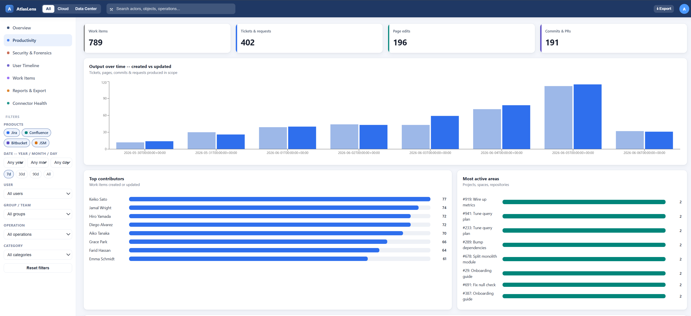
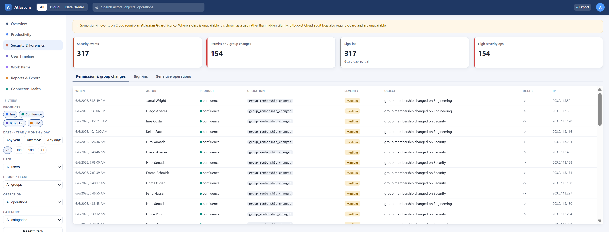
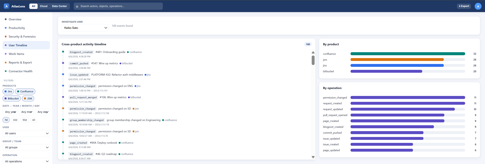
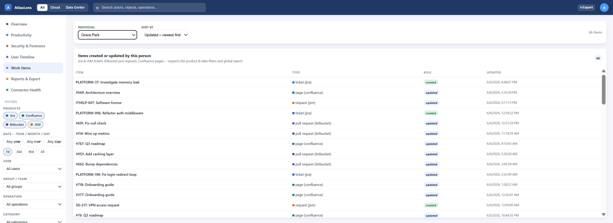
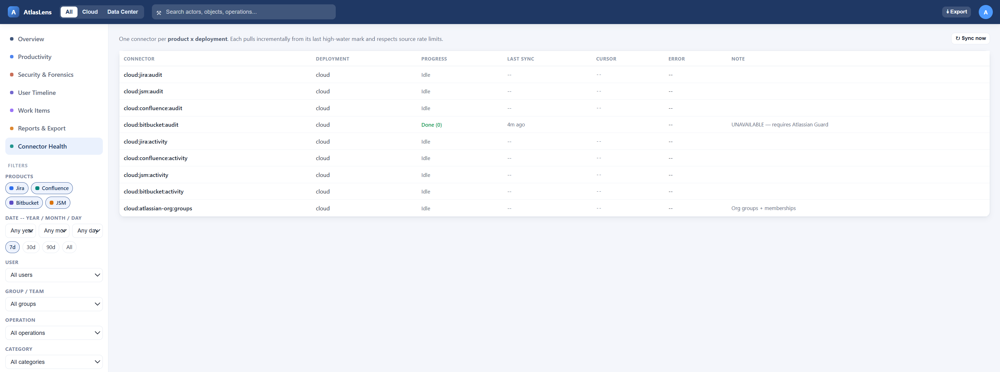
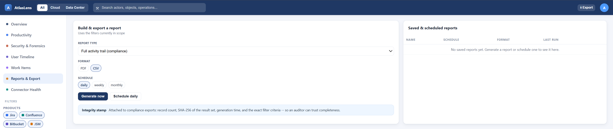

# AtlasLens

[](https://docs.atlaslens.lithastra.com)
[](LICENSE)

A local, admin-only web dashboard that continuously pulls **audit** and **activity** data from your Atlassian Cloud suite — Jira, Confluence, Bitbucket, and Jira Service Management — normalises it into one store, and presents a unified view for filtering, trends, rankings, and forensic investigation.

📖 **Full documentation: [docs.atlaslens.lithastra.com](https://docs.atlaslens.lithastra.com)**

## Screenshots


*Overview — KPI cards, event-volume timeline, activity-by-product split, recent events, and top contributors.*

| | |
|:---:|:---:|
|  |  |
| **Productivity** — created-vs-updated trends, contributor & area rankings | **Security & Forensics** — permission/group changes, sign-in Guard gap surfaced honestly, sensitive ops |
|  |  |
| **User Timeline** — cross-product per-user investigation | **Work Items** — per-person tickets, PRs, and pages with deep links |
|  |  |
| **Connector Health** — live per-connector sync status & cursors | **Reports & Export** — filtered CSV/PDF with integrity stamp |

> Screenshots are from the [2-minute demo](#try-it-in-2-minutes-no-atlassian-instance-needed) (synthetic data).

## Try it in 2 minutes (no Atlassian instance needed)

Bring up the full stack pre-loaded with synthetic data and explore every view:

```bash
docker compose -f docker-compose.demo.yml up --build
# then open http://localhost:8080  →  log in as  admin / atlaslens-demo
```

This seeds ~4,000 synthetic events across Jira, Confluence, Bitbucket, and JSM, plus 12 people and 4 teams, so Overview, Productivity, Security, Timeline, and Work Items are all populated. Tear down with `docker compose -f docker-compose.demo.yml down -v`.

## Features

- **Two ingestion pipelines** — security/forensics (audit logs) and productivity (content/activity) feeding one unified event store
- **Incremental sync** — cursor-based polling with idempotent upserts; no duplicates, no data loss windows
- **On-demand sync + live status** — trigger a sync from the dashboard and watch per-connector progress in real time; only one sync runs at a time, and a new run pre-empts the in-flight one
- **Cross-product investigation** — per-user timelines spanning all four Atlassian products
- **Filtering & aggregation** — every KPI, chart, and ranking honours the active filters (product, date, user, group, operation, category, severity)
- **Work items view** — per-person list of tickets, PRs, and pages with deep links
- **Compliance exports** — CSV/PDF with integrity stamps (count, SHA-256, filter criteria, timestamp)
- **Field-level encryption** — email identifiers encrypted at rest (display names kept plaintext for query/aggregation; see [COMPLIANCE.md](COMPLIANCE.md))
- **1-year retention** — enforced by MongoDB TTL index

## Tech Stack

- **Backend:** Python 3.11+, FastAPI, Motor (MongoDB async), Pydantic v2, httpx, APScheduler
- **Frontend:** React, TypeScript, Vite
- **Storage:** MongoDB (local/self-hosted via Docker)

## Quick Start

```bash
# Start MongoDB
docker compose up -d mongo

# Install backend
pip install -e ".[dev]"

# Provision an admin account
python -m atlaslens.cli.seed_admin --username admin

# (optional) load synthetic demo data to explore without Atlassian
python -m atlaslens.cli.seed_demo

# Run the API server
uvicorn atlaslens.api.main:app --reload

# Run the frontend
cd frontend && npm install && npm run dev
```

Copy `.env.example` to `.env` and fill in your Atlassian credentials before running.

## Deploy on Kubernetes (Helm)

A Helm chart is provided in [`charts/atlaslens`](charts/atlaslens). It deploys the backend, frontend, and an optional single-node MongoDB. Each `v*` tag publishes the chart **and** the container images to GHCR (all public — no pull secrets needed) via the [release workflow](.github/workflows/release-chart.yml):

- Chart — `oci://ghcr.io/lithastra/charts/atlaslens`
- Backend image — `ghcr.io/lithastra/atlaslens-backend`
- Frontend image — `ghcr.io/lithastra/atlaslens-frontend`

Install the latest release (**1.2.0**):

```bash
helm upgrade --install atlaslens oci://ghcr.io/lithastra/charts/atlaslens --version 1.2.0 \
  --namespace atlaslens --create-namespace \
  -f my-values.yaml \
  --set backend.image.repository=ghcr.io/lithastra/atlaslens-backend \
  --set frontend.image.repository=ghcr.io/lithastra/atlaslens-frontend
```

The image `tag` defaults to the chart's appVersion (`1.2.0`), so only the repositories need pointing at GHCR. Pass Atlassian tokens and the encryption/JWT secrets via your values file (never commit them) or point `secrets.existingSecret` at a Secret you manage. After install, seed an admin (there is no signup page by design):

```bash
kubectl -n atlaslens exec deploy/atlaslens-backend -- python -m atlaslens.cli.seed_admin --username admin
```

See the [chart README](charts/atlaslens/README.md) for all values and secret handling.

## Releases

Versioned releases are tracked on the [GitHub releases page](https://github.com/lithastra/atlaslens/releases). The current release is **[v1.2.0](https://github.com/lithastra/atlaslens/releases/tag/v1.2.0)**, which adds on-demand sync with live per-connector status, filter scoping across all aggregations, timezone-correct timestamps, and publishing of the container images alongside the Helm chart.

## Status

All planned phases (P0–P7) are implemented and verified against live data.

| Area | Status |
|---|---|
| Audit pipeline — Jira, Confluence, JSM | ✅ Ingesting |
| Activity pipeline — Jira, Confluence, Bitbucket, JSM | ✅ Ingesting |
| Incremental sync — watermarks + idempotent upserts | ✅ |
| Identity resolution — accountId → person, cross-product | ✅ |
| Group / canonical-team resolution + membership | ✅ |
| Query API + JWT auth + admin seeding (CLI) | ✅ |
| On-demand sync + live per-connector status (cancellable, single-run) | ✅ |
| Dashboard — Overview, Productivity, Security, Timeline, Work Items, Reports, Health | ✅ |
| CSV / PDF exports with integrity stamp | ✅ |
| Compliance — 1-year TTL, email encryption, append-only, bcrypt | ✅ (see [COMPLIANCE.md](COMPLIANCE.md)) |

## Known Gaps & Out of Scope

These data sources are surfaced honestly in the UI rather than faked.

**Unavailable without Atlassian Guard (Access):**

- **Bitbucket Cloud audit logs** — the audit-log API requires Guard. Bitbucket contributes *activity data only* (commits, PRs).
- **Cloud sign-in events** — authentication/login events require Guard. The Security view surfaces this gap explicitly.

**Out of scope (no available environment / credential):**

- **Data Center connectors** — require a Data Center instance; this build is Cloud-only. The adapter layer leaves room to add them later.
- **Org-events audit** — requires an Atlassian Organization API key (Bearer), which is not provisioned.

## Contributing

Contributions are welcome. Please read [CONTRIBUTING.md](CONTRIBUTING.md) before opening a pull request.

This project uses the [Developer Certificate of Origin (DCO)](DCO). All commits must be signed off:

```bash
git commit -s -m "Your commit message"
```

## License

Licensed under the [Apache License, Version 2.0](LICENSE).

## Support

If AtlasLens is useful to you, you can support its development: [buy me a coffee](https://buymeacoffee.com/lithastra) ☕

## Disclaimer

AtlasLens is **not affiliated with, endorsed by, or sponsored by Atlassian.**

Atlassian, Jira, Confluence, Bitbucket, Jira Service Management, and Atlassian Guard are trademarks or registered trademarks of Atlassian Pty Ltd. All product names, logos, and brands referenced in this project are property of their respective owners and are used solely for identification purposes.

This project does not bundle, embed, or redistribute any Atlassian software. It communicates with Atlassian products exclusively through their publicly documented REST APIs using credentials provided by the end user.
