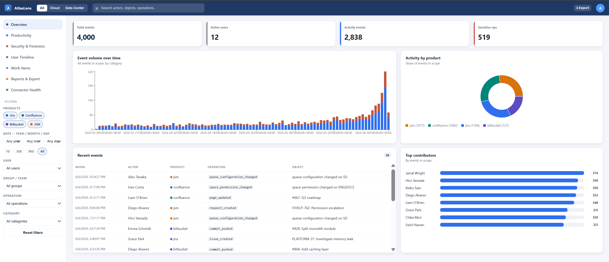

# AtlasLens

**AtlasLens** is a local, admin-only web dashboard that continuously pulls **audit** and
**activity** data from your Atlassian Cloud suite — Jira, Confluence, Bitbucket, and Jira
Service Management — normalises it into one store, and presents a unified view for filtering,
trends, rankings, and forensic investigation.



## Why AtlasLens

- **One store, two pipelines.** Security/forensics data (logins, permission changes, admin
  actions) comes from the products' *audit-log* APIs; productivity data (issues, pages,
  commits) comes from their *content/activity* APIs. AtlasLens ingests both into a single
  normalised event store.
- **No Atlassian Guard required.** It relies on product-level audit logs and activity APIs, so
  you can audit Atlassian Cloud without a Guard/Access licence. Guard-gated sources are
  surfaced honestly rather than faked — see [Connectors & data sources](connectors.md).
- **Self-hosted & private.** Runs on your own infrastructure with a local MongoDB. Personal
  identifiers are encrypted at rest and data is retained for one year via a TTL index.
- **Admin-only.** A simple login protects every view; accounts are provisioned by an
  operator, with no self-service registration.

## Get started

<div class="grid cards" markdown>

- :material-rocket-launch: **[Try the demo](install/demo.md)** — explore a populated dashboard
  in 2 minutes with synthetic data, no Atlassian instance needed.
- :material-docker: **[Docker Compose](install/docker.md)** — run the full stack locally
  against your own Atlassian Cloud.
- :material-kubernetes: **[Kubernetes (Helm)](install/kubernetes.md)** — deploy from the
  published GHCR chart and images.
- :material-cog: **[Configuration](configuration.md)** — environment variables, secrets, and
  Helm values.

</div>

## How it works

```
6 Presentation   React dashboard (filters, charts, tables, export) + login
5 API            FastAPI: auth, search, aggregations, exports, sync control
4 Storage        MongoDB: events + identities + groups + sync_state + users
3 Normalise      RawEvent -> Unified Event; identity & group resolution; UTC
2 Adapters       one connector per product (Cloud)
1 Sources        Jira / Confluence / Bitbucket / JSM
```

See [Architecture](architecture.md) for the full design.

!!! note "Not affiliated with Atlassian"
    AtlasLens is an independent open-source project. It communicates with Atlassian products
    only through their publicly documented REST APIs, using credentials you provide.
